It's no secret I love Ansible.
There are many reasons for that, but today's reason is the way it very effectively bridges the gap between traditional IT practices and magic devops land.
One day we'll all be in magic devops land, where everyone is a coder, and nothing at all is ever done manually.
But today, at least in my organization, we're just not there.
While ansible is very accessible, it does still require some coding, or atleast typing into text files then running them.
If you've spent a lifetime clicking boxes, that could be a little daunting at first.
Even if you have a playbook built for you, there's still the matter of verifying your inventory, running the command, passing and securing the credentials, etc.

Ansible Tower / awx takes that accessiblity a step further, by providing a pointy-clicky web interface for running playbooks.
So now when you are given that playbook to run, all you have to do is login to the website, find the playbook by name, and click on the *launch* icon to run it.
Even building inventories is a mostly point and click affair.
If facebook has taught us anything, it's that *anyone* can use a website.
So this web interface for ansible makes it immensely accessible, which is a great thing for your organization.
But what does it mean to use tower/awx?
While it does a very good job of obfuscating the gory details, it is, at its core, just a way to run your playbooks.
In the next sections I'll go into more details about the various pieces of the interface, how they compare to the ansible counterparts, and some of the ways you might use them.

But first, here are some first looks at the interface, and how things are organized.
Actually, first, first, a quick note about the naming.
*awx* is the name of the open-source project for this product, and is available in [multiple formats](https://github.com/ansible/awx/blob/devel/INSTALL.md).
*tower* is the name of the RedHat supported product.
It's basically awx that has been tested, verified, and supported by RedHat.
It costs money, but with that you get support, and some additional content.
All the stuff that companies like to have.

So now, here's some visuals.

The main home screen:

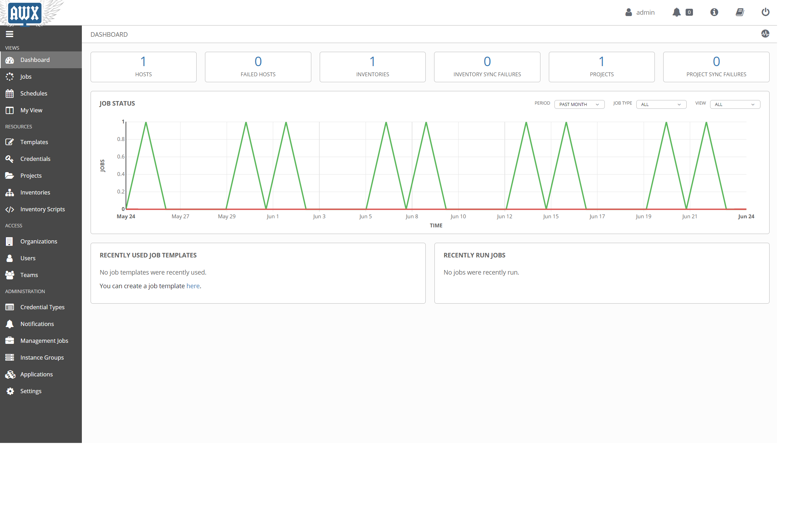

The list of previously run jobs:

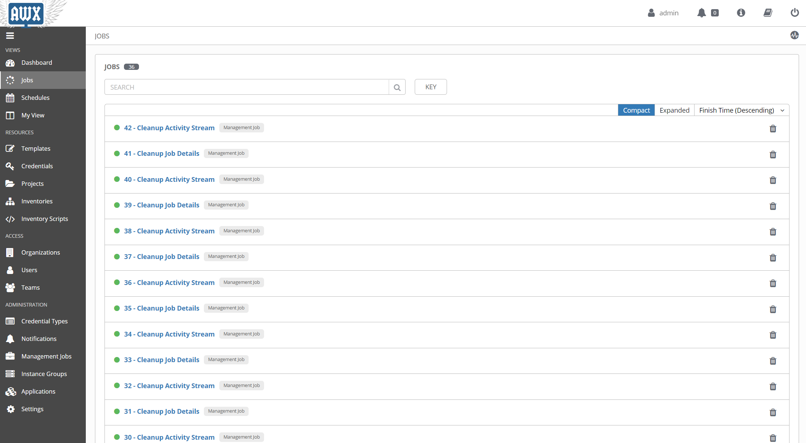

the list of defined templates, which are how awx runs playbooks:

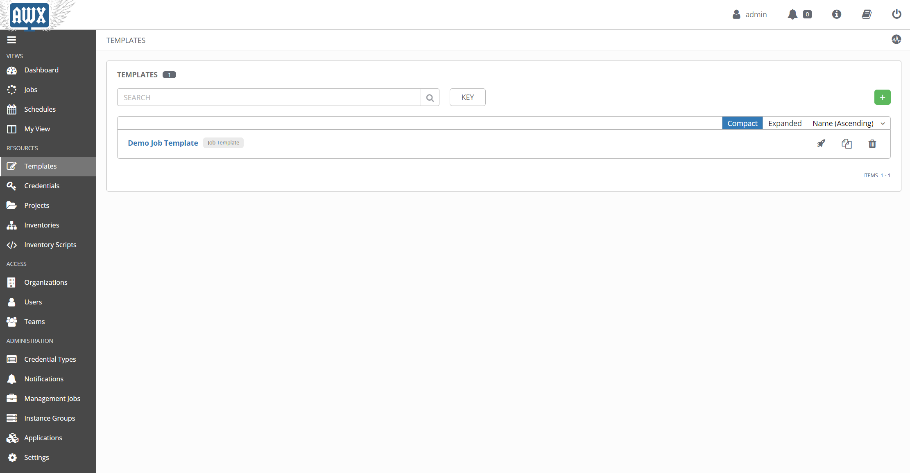

details of an awx inventory:

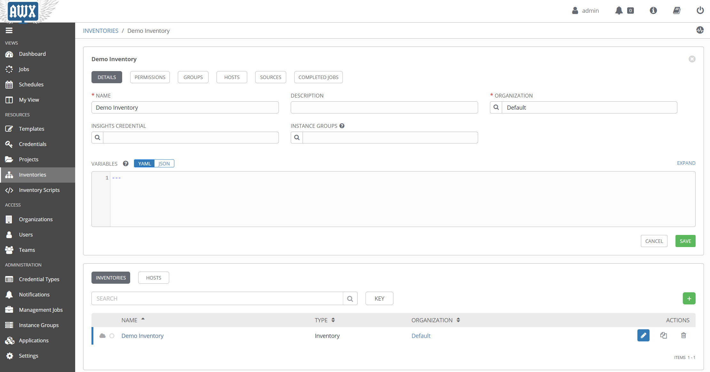

details of a job template:

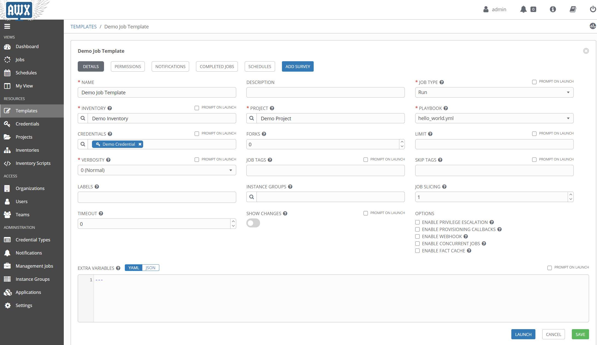


The next few sections will go into details of the various entities within tower, specifically inventories, credentials, and templates.
This will still be just an overview, but it should provide enough info to get started using it, or at least a good idea of how to get started.

# Intimidating Inventories

One of the first things we talk about when using ansible, is the need for an inventory, or *hosts* list, of machines to run the playbook against.
This can be as simple as a text list of machine names:

```ini
server1.domain.com
server2.domain.com
server3.otherdomain.com
```

or it can be complex, with multiple groups, sub-groups, variables, etc.

```ini
[main]
server1.domain.com
server2.domain.com

[backup]
server3.domain.com

[main:vars]
some_var='value'

[servers:children]
main
backup
```

The above examples are using the default ini file format, but inventories can be in YAML as well.

Aside from static lists, an inventory can be *dynamic*, meaning that it is the result of a script that gathers data.
These inventories can be *plugins* or the older *dynamic inventory* scripts, and will execute whenever a playbook runs that references them.

So what does this look like in tower/awx?
Surprisingly, not that different.
For the simple, static inventory, it looks like this.

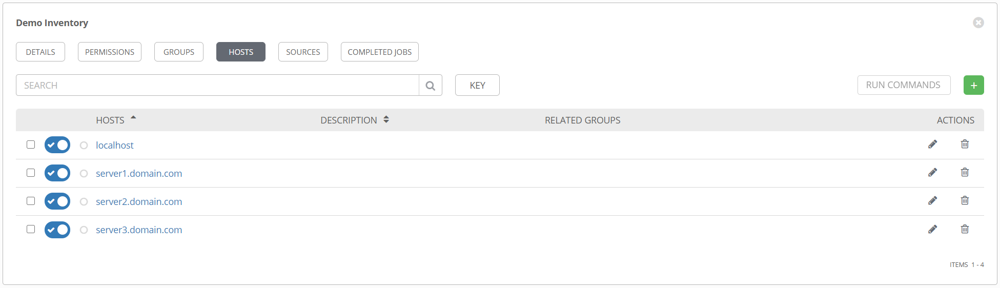

Creating this is as simple as clicking on the + sign, then typing in the machine name.
Note that if you want to specify host-specific variables, or `hostvars`, you can add those in the *VARIABLES* pane here.

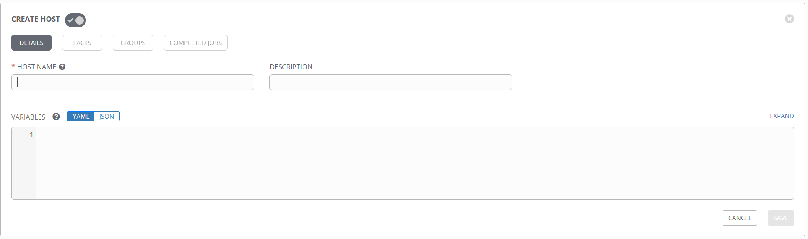

Additionally, you can create and add groups to the inventory from the *GROUPS* section.
`groupvars` can be added the same way `hostvars` are, by adding variables to the group definition.

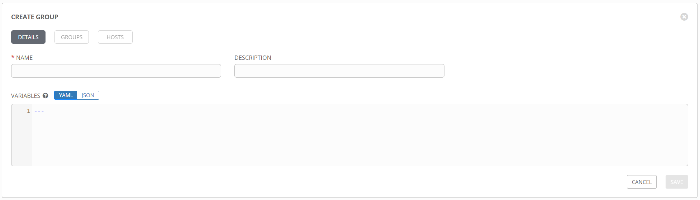

Just like a standard inventory file in ansible, groups can be nested and variables added anywhere you like.

## Inventory Plugins

When static inventory lists don't work for you, ansible provides two options for dynamically populating an inventory file.
Well, techincally only one option, as [dynamic inventories](https://docs.ansible.com/ansible/2.5/dev_guide/developing_inventory.html) are, I believe, officially deprecated.
So that leaves [inventory plugins](https://docs.ansible.com/ansible/latest/plugins/inventory.html).
Inventory plugins are a great way to connect to remote data sources to retrieve real time inventory data when running playbooks.
And as you might guess, they are fully supported in tower/awx.
These are refered to as *inventory sources* and can be added to an existing inventory object.

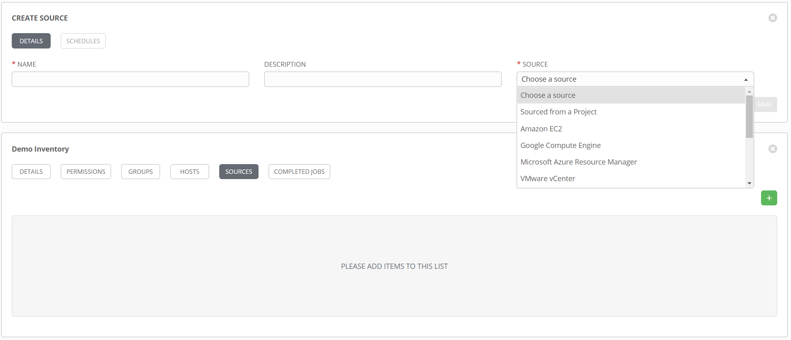

You can see from the dropdown list there are several pre-existing sources to choose from.
Things like Azure, vCenter, Amazon, etc.
But also, the option *Sourced from a Project* is an interesting option, as it opens up several additional options.
Want to use a static list of hosts but want to maintain that in source control instead of in tower directly?
Select *Sourced from a Project* and point it at a hosts file.
Want to use a custom inventory plugin that doesn't exist in tower?
Select *Sourced from a Project* and point it to the inventory config file.

**NOTE:** Keep an eye out for a future blog post that goes into the details of how to create an inventory plugin, and how to use it in tower/awx.


# Complex Credentials
When performing configuration tasks against machines, it's common to need to provide credentials to various systems.
Obviously storing these in plain text is not an option, so ansible provides the `ansible-vault` [command](https://docs.ansible.com/ansible/latest/user_guide/vault.html), which allows for encryption of credentials for safekeeping, while still allowing for use in playbooks.

That works great for many use cases, but when you start talking about encapsulating playbooks in tower/awx and potentially sharing them with other people, it doesn't scale terribly well.
Luckily tower/awx provides an alternative, the [credential](https://docs.ansible.com/ansible-tower/latest/html/userguide/credentials.html) object.
These are standalone objects that can be attached to multiple templates, and provide credentials to the playbook in a secure fashion.
There are several different credential types, but they all have the same common goal; to insert the various data they contain into a particular location in a playbook.
Some credentials will set environment variables with the data at runtime.
Other credentials will pass their data in as an extra_var.
Regardless, understanding how to reference the output of a credential in a playbook is key.
I was hoping to be able to link to a great article that shows, for each credential type, how to reference them in a playbook, but I could find no such article.
The [credential](https://docs.ansible.com/ansible-tower/latest/html/userguide/credentials.html) documentation page outlines the details of how to create the credential objects, but doesn't mention the outputs.
Stay tuned for a blog plost that goes into the missing details.

Here's an example of a credential for Azure, with inputs that are very specific to Azure.


Here's an example of a credential for VMware vCenter.

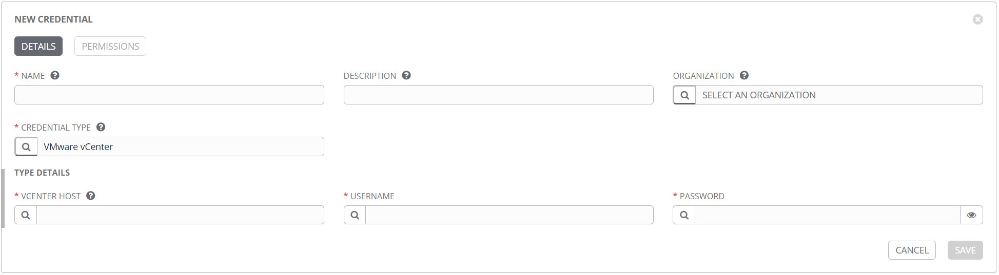

Once a credential is created, it can be found in the *Credentials* section.

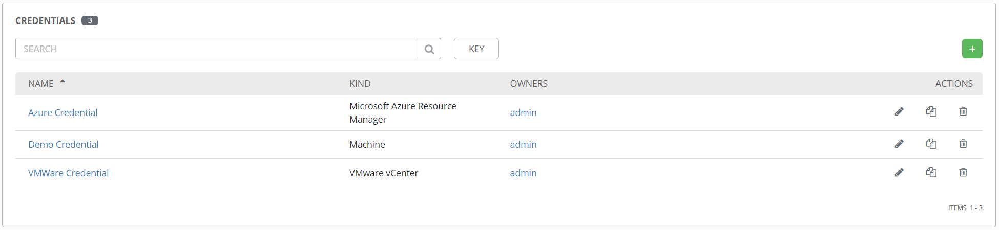

These can be attached to one or more templates to provide their data at runtime.
One nice feature of credentials, like everything in tower, is the role-based access control (RBAC).
Very specific permissions can be granted for a credential object, including read, use, edit, etc.
This means you can give someone access to use a credential object in tower, but no access to edit it or see the details.

Another benefit of the centralization of credentials comes at password change time.
With a vaulted secret, you must re-encrypt the new password and edit the file it' saved in.
For a single password in a single file this may not be a big deal, but if you have an account used in several different projects, with encrypted passwords in numerous locations, password change time can be a huge burden.
With a single credential object used multiple times, you only need to change it in a single place.

Next up we'll talk about how to use those credentials and inventories to actually run something.

# Terrifying Templates

First things first, I want to talk about the name, *templates*.
This is in no way related to the [template module](https://docs.ansible.com/ansible/latest/modules/template_module.html) in ansible, where you can have a marked up file that gets modified and placed on a target system.
You can still use templates in a playbook as you normally would, but in tower/awx, a template is an object used to define the parameters for running a playbook.
This is where everything comes together, and is analagous to running the `ansible-playbook` command with all the necessary optional parameters.
When you execute a template, tower/awx creates a job, which is an instance of the template that runs, and gathers the output.

Ok, naming aside, here is what a template definition form looks like.


The [official documentation](https://docs.ansible.com/ansible-tower/latest/html/userguide/job_templates.html) goes into great detail, but just from the image you will hopefully recognize the more commonly used elements needed to run a playbook.

One thing that may not be apparent from the image is that the `CREDENTIALS` field supports multiple entries.
So if you have a machine credential, an Azure credential, etc., you can add them all to the template at the same time.
It's worth noting that you can only have one credential of each type, so one machine credential, one Azure credential, etc.
It's also worth nothing that the `PLAYBOOK` field is a dropdown, not a text field.
That begs the question, how does tower/awx know what your playbook is?
That comes from another element of tower/awx that we haven't covered yet, the *project*.

# The Project

Up until now, everything I've shown is an element created inside tower.
But ansible is all files, so where do those go?
That's where the project comes in.
The project is where you define the relationship to your ansible files and folders for use in tower.
Take a look at this new project form.

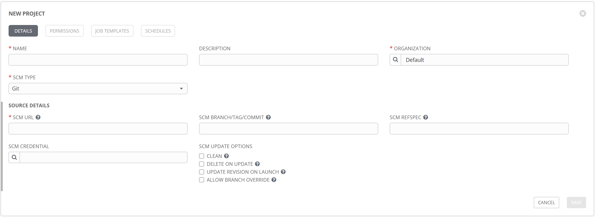

The idea here is that none of your ansible files are stored on the server hosting tower, but rather are pulled directly from your source control repository at runtime (with caching, etc.).
This is a fantastic way to control the flow of your data, and provides motivation for putting everyhing in source control, where it belongs.
Other types are supported, including mecurial, svn, and technically a manual option that you probably don't want to use.
Note that in addition to the repository URL, you can specify a specific branch or commit to pull, so you get great control over which files are used.
This option can be used to have a development project and a production project, so you can match those up with your repositories and do thorough testing without affecting production.
The `SCM CREDENTIAL` field is where you specify the credential object of the *source control* type.
This credential might look like this:

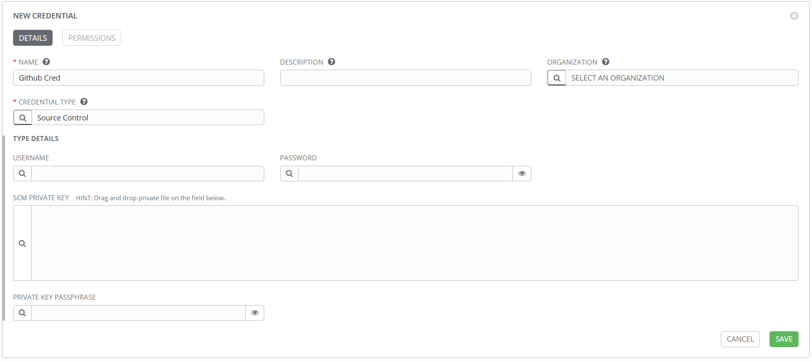

Depending on your particular source control product, it may be best to use SSH rather than HTTPS.
If that's the case, then the source control credential object should include the SSH private key, rather than a simple username/password combo.

Stay tuned for a future blog post that goes into setting this up in more detail, both from tower and the source control side.

Once you have a project created, tower should automatically run a sync job, to attempt to connect to your repository and pull the data.
If it is successful, the project listing page will show your project with a green dot next to it.
This will be red if the update failed, and white if it's never been run, as shown in this example.

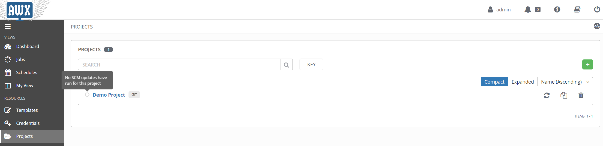

As you make updates to your ansible code and commit them to your source control repository, you can use the refresh icon on the right to force an update from tower.
There's also the option in the project settings to `UPDATE REVISION ON LAUNCH`, which will force an update any time you run a template from this project.
That can be a great time saver in the development and testing stages, when you might be making rapid changes to a project.
