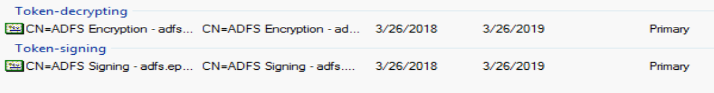
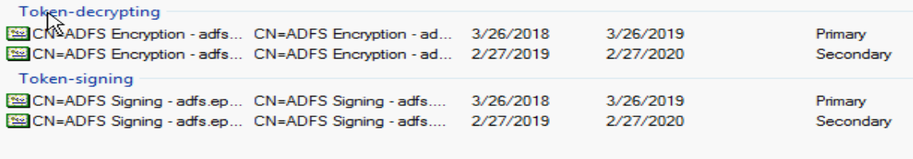
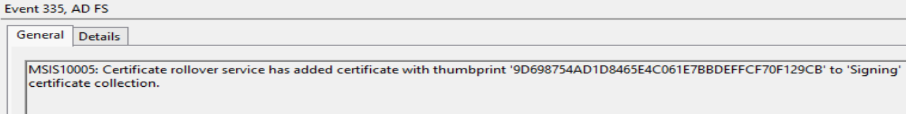
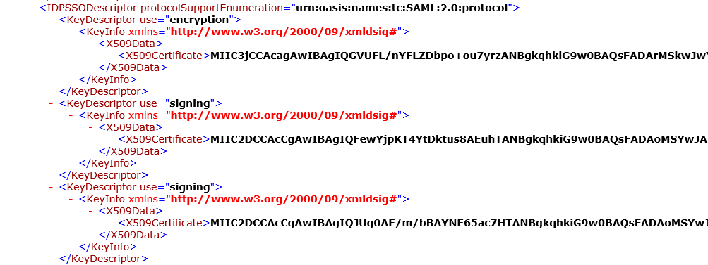
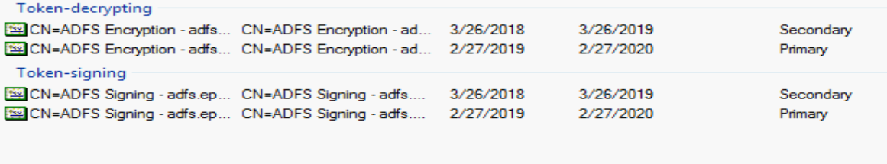
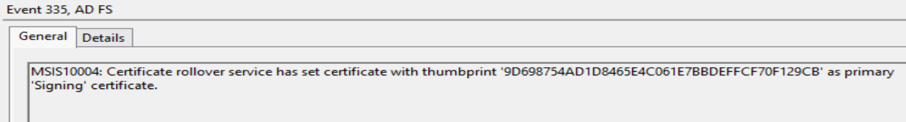
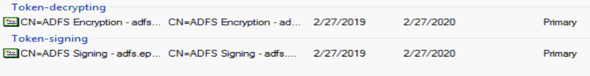
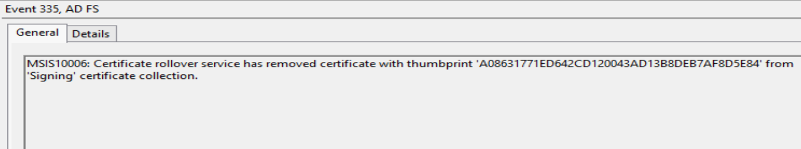
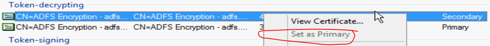

INT. HOME IN BED - MIDNIGHT

The phone rings suddenly, waking the Sysadmin from his peaceful slumber.  He wakes immediately and answers the phone quietly and with a measured gravity that can only come from decades of practice.  "This is Steve" he says.  It's the NOC.  Of course it is.  "We think there's something wrong with ADFS" the slightly panicked engineer squeeks.  "We can't get to all these apps, we get a certificate error and authentication failed!"  Shit.  The Sysadmin looks at his calendar, thinking back to about this time last year.  Shit.  The ADFS token signing certificates probably rolled over again without us noticing. "I'm logging in now, give me 5 minutes".  The sysadmin grinds his teeth as he fires up his laptop.  It's going to be a long night.

/scene

# AutoCertificateRollover

Or maybe not!  If you have found yourself in the above, totally fictional, not at all based on my own experiences, situation, you might have been slightly panicked as well.  So what's going on here?  Well let's talk about that, but first, if you're in the above emergency right now, you probably don't care why.  [Go to the next section](#fix-it-now-make-the-bleeding-stop) on how to fix it, then come back and read this part at your leisure.

If you open your ADFS Management Console, you can naviate to the certificates page and see something like this:



This is what you will see most times of the year, when your certificates are valid and not nearing expiration.  In this example, once next March nears, you'll see something like this:



This is what you'll see if your 'Primary' certificates are nearing expiration.  ADFS has taken the liberty to create new certificates and mark them as 'Secondary'.  If we pretend that today's date is 2/27/2019, we'll see that we have about a month until our primary certificates expire.  We have our new certificates already created and ready to go, however.  In addition to creating these certificates for us, ADFS is even kind enough to tell us about it in the ADFS Event log.  I mean, you're watching your ADFS event log for important informational messages all the time right?  Yeah of course, we all are.  But in case you missed this one here's what it looks like.

  The new certificates show up in our federation metadata as well, which we can browse to and verify.



You can see among all the XML, two certificates with a KeyDescriptor use of "signing".  So those are our two certs, and the fact that they're in the metadata means that any relying parties that are configured to update themselves from this metadata URL can pull in the new certificates automagically.  In fact, many commonly used applications that you might federate with fully support this automatic certificate rollover, so you may not even notice this is happening.  That's probably why there are so few articles about this online (Or my google-fu is just bad).

Anyway, in our scenario our relying parties do not automagically anything, so let's continue with our process.  Let's fast forward our time machine precisely 5 days, upon which ADFS will decide to swap our primary and secondary slots.  If we refresh our ADFS management console we will now see the new certificates listed as Primary.  We can also see another totally obvious event log entry.





Our swap is done with 3 weeks to spare before the old certificates expire.  Plenty of time to fix any issues before it's too late.  So what happens next?  Well let's fast forward in our time machine one more time, to March 27th, 2019.  This will be one day after our old certificates expire.  To the future!


OMG what happened?!?  We were only gone 3 weeks!  Ok just kidding, it shouldn't be as bad as all that.  Hopefully all you'll see is this event log entry and that the old, expired certificates have been removed.




And that's pretty much it.  All automatic and if all your relying parties support it, extremely seamless.  That process will happen yearly and no one needs to be the wiser.  Now if your environment does look like the above fiery hell, continue reading to find out your options for recovery.

# Fix it Now Make the Bleeding Stop!
I'll assume you are reading this with your boss and his boss and maybe his boss over your shoulder wanting to know when this will be fixed, so I'll be brief.  There are two scenarios you might find yourself in.  Your recovery can vary drastically depending on which one you are experiencing.

## Scenario 1: Automatic Certificate Rollover

Your ADFS server created new token-signing and token-decrypting certificates 5 or so days ago, and has now decided to swap these new certificates into the "primary" role.  The "old" certificates are now in the "secondary" role, but still valid for a few more weeks.  Any applications that don't support the use of secondary certificates are now failing authentication.  

__Note__:
>These are the default settings for ADFS 2012R2.  If you have't changed any values this scenario will play out just like this.

Our rapid, short term resolution plan is basically to swap the secondary certificates back into the primary slot.  That's the one the applications are trusting, so that's the one that they want to see.  We can update the apps with the new certificate later, but right now we want them talking again.  Maybe you've opened up your ADFS management console and see something like this:


You cannot manually select the primary certificate because auto-rollover is enabled.  This must be disabled before you can fix it.  Like most things, the best way to do this is with Powershell.  Open a remote session to your primary ADFS server and run the following:

``` powershell
#Disable automatic certificate rollover so we can manually swap the certificate roles
Set-ADFSProperties -AutoCertificateRollover $False
#Get the current secondary certificates
$TokenSigningSecondary = Get-AdfsCertificate -CertificateType Token-Signing | where-object{$_.IsPrimary -eq $False}
$TokenDecryptingSecondary = Get-AdfsCertificate -CertificateType Token-Decrypting | where-object{$_.IsPrimary -eq $False}
#Now set the above secondary certificates to Primary
Set-AdfsCertificate -Thumbprint $TokenSigningSecondary.Thumbprint -IsPrimary -CertificateType Token-Signing
Set-AdfsCertificate -Thumbprint $TokenDecryptingSecondary.Thumbprint -IsPrimary -CertificateType Token-Decrypting
```

Technically after disabling certificate rollover with the first command above, you can go back to the management console and click that "Set as Primary" button.  But since you're already in powershell and likely in a hurry, that whole bit of code will do that for you.

At this point you are officially reverted.  All your relying parties should be working again.  You still need to get those new certs into those relying parties, but you've got a little time now.  All of your bosses can go back to their spreadsheets, and you can start writing up your Post Mortem or Incident Report with a full explanation of how you saved the day!

## Scenario 2: Expired Certificate

This scenario occurs after the above.  Your certificates swapped roles a couple of weeks ago, and now your old certificates in the "secondary" role have expired.  If you have apps that were able to function with the secondary certificate, they may have worked fine up until this point.  Unfortunately if you are at this point you don't have a quick resolution plan.  The only way around an expired certificate is to replace it.  You've got to export those new certificates and work with the relying parties to update their application configurations.  This process would have been much easier had you done it last week, but don't call it a failure, call it an opportunity!

# Now What?

Hopefully at this point all is calm, the phone has stopped ringing and you've finished explaining to the 50th person exactly what just happened.  So now what do you do?  Well first you've got to decide if you want to leave auto rollover disabled or turn it back on.  If you turn it back on you could possibly monitor for event ID 335 in the ADFS log, that will cover all of your certificate operations.  Maybe you want to leave it off though and just monitor the token-signing and token-decrypting certificates as they age.  This snippet can be used to determine the expiration date of a certificate, so you could watch for that to get near and then take action yourself.

```powershell
Get-AdfsCertificate -CertificateType "Token-Signing" | where-object{$_.isprimary -eq $True} | select-object -expandproperty certificate | select-object -expandproperty notafter
```

Whatever you decide to do, make a point to plan and document it now, while everything is still in your head.  If you don't already have it written down, make notes of all the relying parties that failed, and how you went about fixing them and updating the certificates.  Make notes like you're going to read them a year from now.  Your future self will thank you.