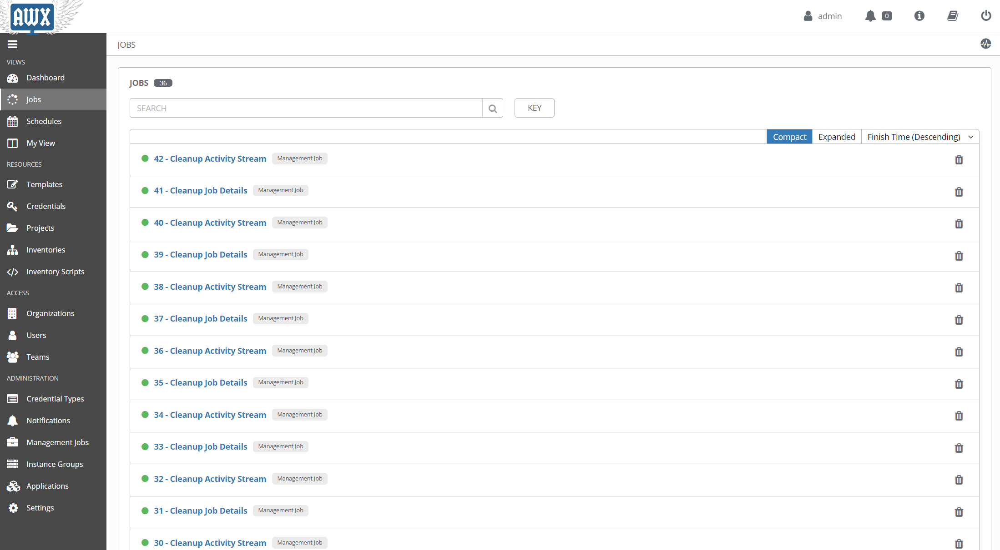
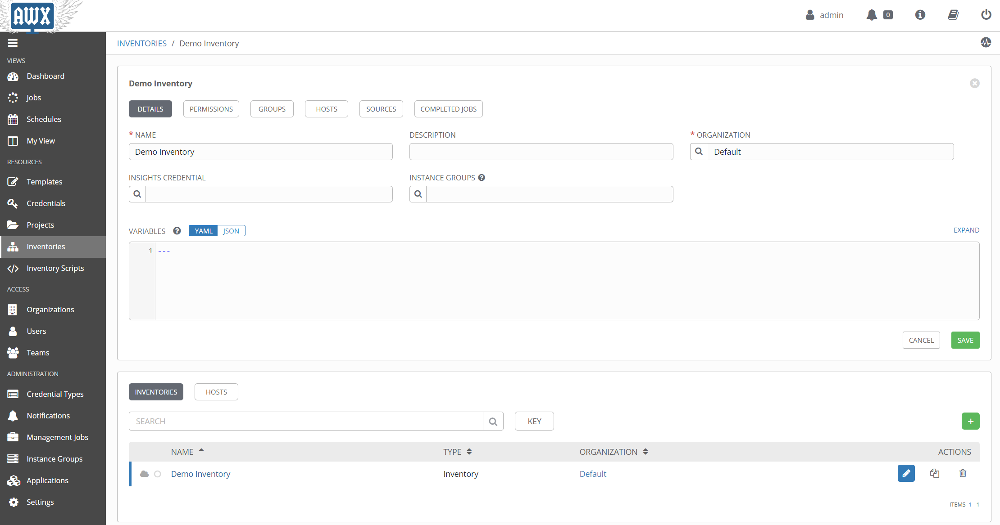
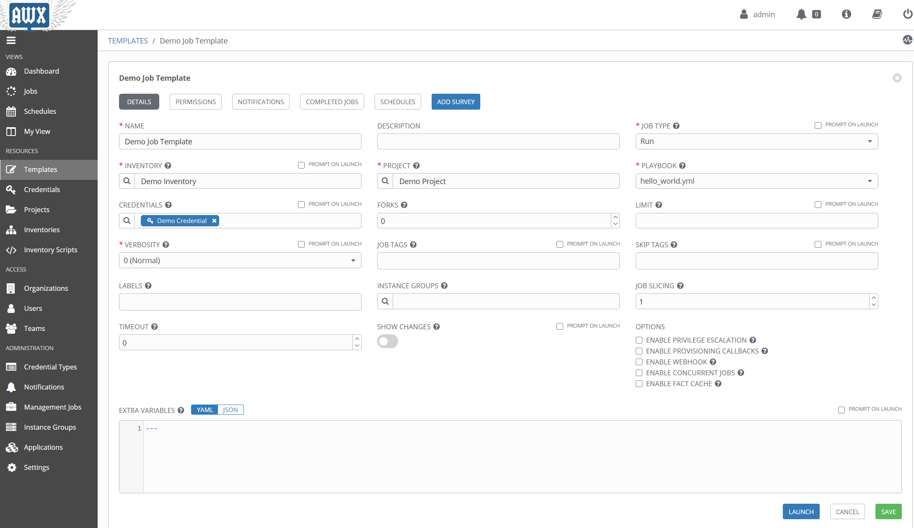
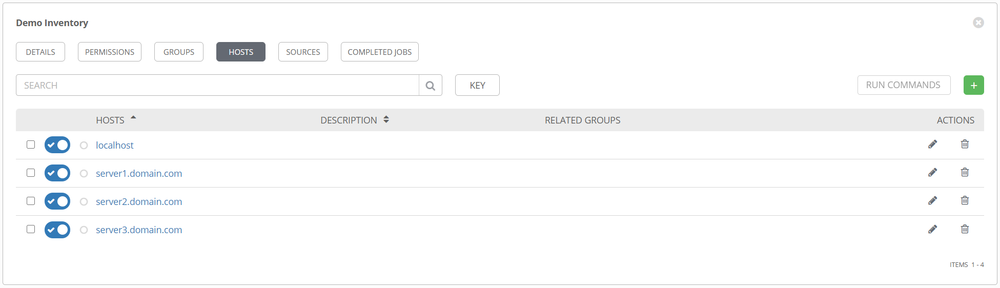
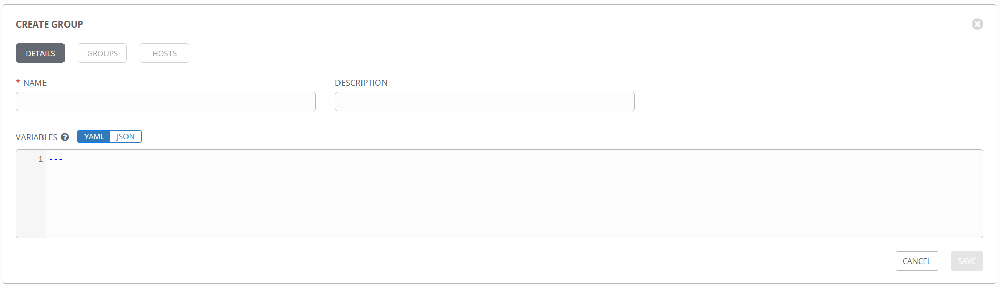
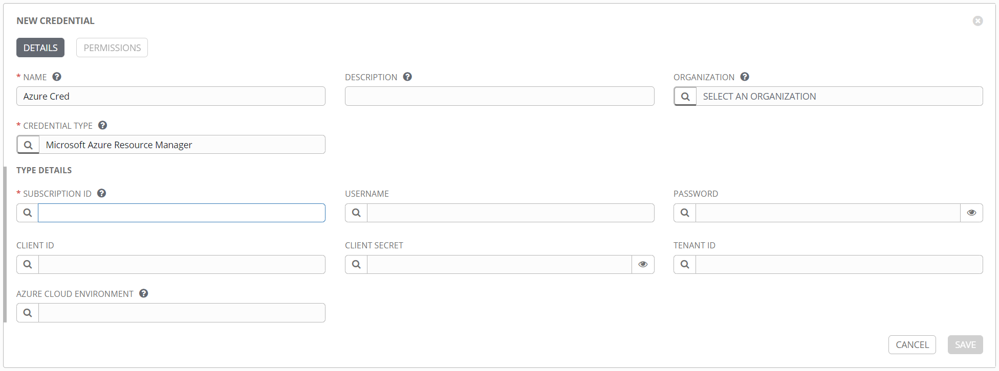
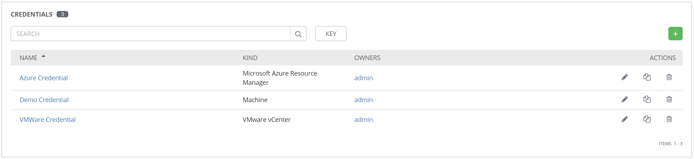
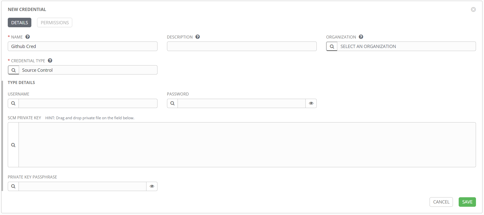

It's no secret I love Ansible.
There are many reasons for that, but today's reason is the way it very effectively bridges the gap between traditional IT practices and *magic devops land*.
One day we'll all be in magic devops land, where everyone is a coder, and nothing at all is ever done manually.
But today, at least in my organization, we're just not there.
While Ansible is very accessible, it does still require some coding, or at least typing into text files then running them.
If you've spent a lifetime clicking boxes, that could be a little daunting at first.
Even if you have a playbook built for you, there's still the matter of verifying your inventory, running the command, passing and securing the credentials, etc.

Ansible Tower takes that accessibility a step further, by providing a pointy-clicky web interface for running playbooks.
So now when you are given that playbook to run, all you have to do is login to the website, find the playbook by name, and click on the *launch* icon to run it.
Even building inventories is a mostly point and click affair.
If facebook has taught us anything, it's that *anyone* can use a website.
So this web interface for Ansible makes it immensely accessible, which is a great thing for your organization.
But what does it mean to use Tower?
While it does a very good job of obfuscating the gory details, it is, at its core, just a way to run your playbooks.
In the next sections I'll go into more details about the various pieces of the interface, how they compare to the Ansible counterparts, and some of the ways you might use them.

But first, here are some first looks at the interface, and how things are organized.
Actually, first, first, a quick note about the naming.
*awx* is the name of the open-source project for this product, and is available in [multiple formats](https://github.com/ansible/awx/blob/devel/INSTALL.md).
*Tower* is the name of the RedHat supported product.
It's basically awx that has been tested, verified, and supported by RedHat.
It costs money, but with that you get support, and some additional content.
All the stuff that companies like to have.

So now, here's some visuals.

The main home screen:


The list of previously run jobs:



The list of defined templates, which is how awx runs playbooks:


Details of an awx inventory:



Details of a job template:



The next few sections will drill down into the various entities within Tower, specifically *inventories*, *credentials*, and *templates*.
This will still be just an overview, but it should provide enough info to get started.

## Intimidating Inventories

One of the first things we talk about when using Ansible, is the need for an inventory, or *hosts* list, of machines to run the playbook against.
This can be as simple as a text list of machine names:

```ini
server1.domain.com
server2.domain.com
server3.otherdomain.com
```

or it can be complex, with multiple groups, sub-groups, variables, etc.

```ini
[main]
server1.domain.com
server2.domain.com

[backup]
server3.domain.com

[main:vars]
some_var='value'

[servers:children]
main
backup
```

The above examples are using the default ini file format, but inventories can be in YAML as well.

Aside from static lists, an inventory can be *dynamic*, meaning that it is the result of a script that gathers data.
These inventories can be *plugins* or the older *dynamic inventory* scripts, and will execute whenever a playbook runs that references them.

So what does this look like in Tower?
Surprisingly, not that different.
For the simple, static inventory, it looks like this.



Creating this is as simple as clicking on the + sign, then typing in the machine name.
Note that if you want to specify host-specific variables, or `hostvars`, you can add those in the *VARIABLES* pane here.


Additionally, you can create and add groups to the inventory from the *GROUPS* section.
`groupvars` can be added the same way `hostvars` are, by adding variables to the group definition.



Just like a standard inventory file in Ansible, groups can be nested and variables added anywhere you like.

### Inventory Plugins

When static inventory lists don't work for you, Ansible provides two options for dynamically populating an inventory file.
Well, technically only one option, as [dynamic inventories and inventory scripts](https://docs.ansible.com/ansible/2.5/dev_guide/developing_inventory.html) are, I believe, officially deprecated.
So that leaves [inventory plugins](https://docs.ansible.com/ansible/latest/plugins/inventory.html).
Inventory plugins are a great way to connect to remote data sources to retrieve real time inventory data when running playbooks.
And as you might guess, they are fully supported in Tower.
These are referred to as *inventory sources* and can be added to an existing inventory object.


You can see from the dropdown list there are several pre-existing sources to choose from.
Things like Azure, vCenter, Amazon, etc.
Additionally, the option *Sourced from a Project* opens up several additional choices.
Want to use a static list of hosts but want to maintain that in source control instead of in Tower directly?
Select *Sourced from a Project* and point it at a hosts file.
Want to use a custom inventory plugin that doesn't exist in Tower?
Select *Sourced from a Project* and point it to the inventory config file.

See [this article](/Custom-Inventory-Plugins) for more info on using custom inventory plugins in Tower.

## Complex Credentials

When performing configuration tasks against machines, you'll often need to provide credentials to various systems.
Obviously storing these in plain text is not an option, so Ansible provides the `ansible-vault` [command](https://docs.ansible.com/ansible/latest/user_guide/vault.html), which allows for encryption of credentials for safekeeping, while still allowing for use in playbooks.

That works great for many use cases, but when you start talking about encapsulating playbooks in Tower and potentially sharing them with other people, it doesn't scale terribly well.
Luckily Tower provides an alternative with the [credential](https://docs.ansible.com/ansible-tower/latest/html/userguide/credentials.html) object.
These are standalone objects that can be attached to multiple templates, and provide credentials to the playbook in a secure fashion.
There are several different credential types, but they all have the same common goal; to insert the various data they contain into a particular location in a playbook.
Some credentials will set environment variables with the data at runtime.
Other credentials will pass their data in as an extra variable, or `extra_var`.
Regardless, understanding how to reference the output of a credential in a playbook is key.

For a more detailed look at credentials and credential types, see [this blog post](/Credentials-and-Credential-Types).

Here's an example of a credential for Azure, with inputs that are very specific to Azure.



Here's an example of a credential for VMware vCenter.


Once a credential is created, it can be found in the *Credentials* section.



These can be attached to one or more templates to provide their data at runtime.
One nice feature of credentials, like everything in Tower, is the role-based access control (RBAC).
Very specific permissions can be granted for a credential object, including read, use, edit, etc.
This means you can give someone access to use a credential object in Tower, but no access to edit it or see the details.

Next up we'll talk about how to use those credentials and inventories to actually run something.

## Terrifying Templates

First things first, I want to talk about the name, *templates*.
This is in no way related to the [template module](https://docs.ansible.com/ansible/latest/modules/template_module.html) in Ansible, where you can have a marked up file that gets modified and placed on a target system.
You can still use templates in a playbook as you normally would, but in Tower, a template is an object used to define the parameters for running a playbook.
To be even more specific, that is a specific template type called a *job template*, which is what this section is about.
Another type of template is the *workflow template*.
See [this section](#whats-a-workflow) for more detail on those.
This is where everything comes together, and is analogous to running the `ansible-playbook` command with all the necessary optional parameters.
When you execute a template, Tower creates a job, which is an instance of the template that runs, and gathers the output.

Ok, naming aside, here is what a template definition form looks like.


The [official documentation](https://docs.ansible.com/ansible-tower/latest/html/userguide/job_templates.html) goes into great detail, but just from the image you will hopefully recognize the more commonly used elements needed to run a playbook.

One thing that may not be apparent from the image is that the `CREDENTIALS` field supports multiple entries.
So if you have a machine credential, an Azure credential, etc., you can add them all to the template at the same time.
It's worth noting that you can only have one credential of each type, so one machine credential, one Azure credential, etc.
It's also worth nothing that the `PLAYBOOK` field is a dropdown, not a text field.
That begs the question, how does Tower know what your playbook is?
That comes from another element of Tower that we haven't covered yet, the *project*.

## The Project

Up until now, everything I've shown is an element created inside Tower.
But Ansible is all files, so where do those go?
That's where the project comes in.
The project is where you define the relationship to your Ansible files and folders for use in Tower.
Take a look at this new project form.


The idea here is that none of your Ansible files are stored on the server hosting Tower, but rather are pulled directly from your source control repository at runtime (with caching, etc.).
This is a fantastic way to control the flow of your data, and provides motivation for putting everything in source control, where it belongs.
Other types are supported, including mercurial, svn, and technically a manual option that you probably don't want to use.
Note that in addition to the repository URL, you can specify a specific branch or commit to pull, so you get great control over which files are used.
This option can be used to have a development project and a production project, so you can match those up with your repositories and do thorough testing without affecting production.
The `SCM CREDENTIAL` field is where you specify the credential object of the *source control* type.
This credential might look like this:



Depending on your particular source control product, it may be best to use SSH rather than HTTPS.
If that's the case, then the source control credential object should include the SSH private key, rather than a simple username/password combo.

See [this blog post](/Source-Control-and-the-Tower-Project) for more detail on how to configure this connection between Tower and your source control product.

Once you have a project created, Tower should automatically run a sync job, to attempt to connect to your repository and pull the data.
If it is successful, the project listing page will show your project with a green dot next to it.
This will be red if the update failed, and white if it's never been run, as shown in this example.


As you make updates to your Ansible code and commit them to your source control repository, you can use the refresh icon on the right to force an update from Tower.
There's also the option in the project settings to `UPDATE REVISION ON LAUNCH`, which will force an update any time you run a template from this project.
That can be a great time saver in the development and testing stages, when you might be making rapid changes to a project.

## Get a Job

Now that all the pieces are in place, you can run a job.
A job is an execution of a template, and stores execution details, input data, run time, and that wonderful Ansible output you are so used to seeing.


There's also the option to create output data, other than the text output.
This is referred to as an *artifact* and will display on the job status page in its own window when the job finishes.

The purpose of this is two-fold.

1. When using the Tower REST API to get job status, this output data can be referenced directly, potentially to feed other systems or as input into another process.
2. When using a workflow template in Tower, this artifact data is passed to downstream job templates for future processing.

## What's a Workflow

The above section on templates was really only a section on job templates. The other type of template in Tower is a workflow template.
These are used to string together multiple job templates in serial or parallel execution.
It also provides some orchestration functions, things like conditionals for execution, branching based on success or failure status, that sort of thing.
This has grown in features with every version of Tower, so I suspect more features will be added to workflow templates over time.

### When to use a workflow

Like any technology, there are countless "right" and "wrong" ways to use workflow templates, but one of the really interesting uses comes when combining workflow templates and Tower's Role-based Access Control (RBAC).
Imagine a scenario where you, have a complex Job template to do a task.
This is a task that you wouldn't mind allowing other people to run, and could be a great piece of a larger automation function, but it has some sensitive steps that you may not want people to muck around with.
i.e. you don't mind sharing the template, but you don't want to share the code.
Or maybe you just want to make it super easy for another team to run it, without them having to find your code, merge it in with theirs, keep up with any changes you make, etc.

In this scenario you might grant them *Execute* rights to your template, which is just like it sounds, rights to run your template but nothing else.
While it can then be executed as a standalone job, that team could also create a workflow template to combine it with other templates they have created.
You could theoretically have a workflow template with job templates from a dozen other teams, all strung together with only execute rights.
There are a ton of options here, but this is the kind of thing that workflow templates were made for.

The primary configuration option of a workflow template is the *workflow visualizer*, which allows for defining the order and conditions for connecting job templates together.


In this window job templates can be added, either in series or parallel.
Conditions can be selected from the *Add a Node* pane on the right, to define when the selected template should run.
Options here are:

* On Success
* On Failure
* Always

So maybe an email is sent on failure, but a second template runs on success.
Or the other way around, whatever works for your use case.

## Wrapping Up

As promised, this was a very high overview of some of the features of Ansible Tower.
Like most things with Ansible, there are never-ending rabbit holes of details to be explored.
Several additional articles have been linked in the sections above, that attempt to drill down into these subjects with more specifics.
Rather than force you to go on a hunt, they are listed here:

* [Custom Inventory Plugins](/Custom-Inventory-Plugins)
* [Source Control and the Tower Project](/Source-Control-and-the-Tower-Project)
* [Credentials and Credential Types](/Credentials-and-Credential-Types)
* [CyberArk Credential Lookup](/Cyberark-Credential-Lookup)

There are several additional topics worth digging into, and I hope to write more about those in the future.
Hopefully these are helpful though, and provide a good start into the arena of Ansible Tower.
