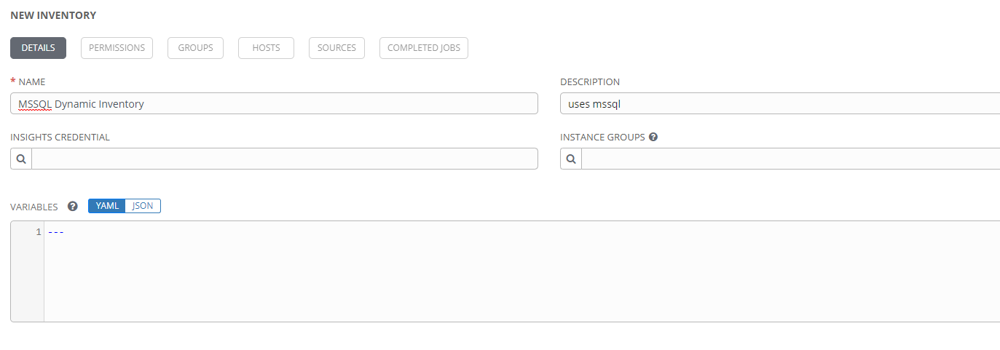
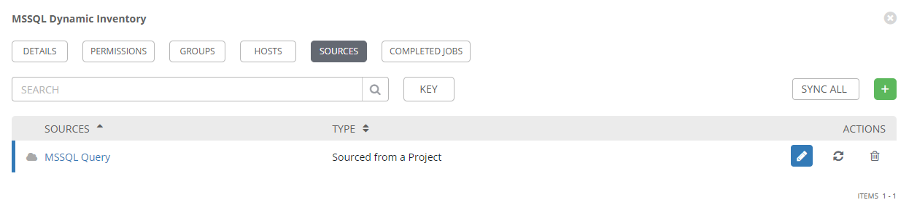
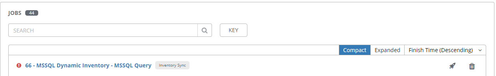

Inventories are necessary for running pretty much anything in Ansible.
These can be simple, static lists with static groups, or they can be dynamically generated, with one or more inventory plugins to source the data.
This article will detail how to build a dynamic inventory in tower, by using an ansible inventory plugin.
The inventory plugin to be used in this demonstration can be found [here](https://github.com/murrahjm/ansible_inventory_plugins).
Specifically, the MSSQL inventory plugin, rather than the Neo4j plugin.
This was written specifically to be a demonstration of how one might reference data in a SQL database for use as inventory.

## Inventory Plugin Overview

For detail on how the inventory plugin itself works, refer to the documentation and code in that repository.
As a general overview though, there are a few files needed for an inventory plugin to work.

* **config.yml** - this is a config file that will feed inputs to the inventory script.
Think of this like a parameter input, much like an ansible playbook that feeds data to a module.
* **inventory_plugin.py** - this is the inventory plugin code.
Inputs from the config file are processed here, and a specifically formatted output is returned to build the inventory
* **ansible.cfg** - this is a general ansible config file that can set any number of properties.
In this particular example, it must include the custom inventory plugin above in the list of enabled plugins.
This is done with the `enable_plugins` option.

> **_NOTE:_**  When using inventory plugins in Tower, the files mentioned above must be kept separate from any playbooks that reference it, at least when using it in awx.
When awx runs an inventory sync with a plugin, it creates an inventory object.
When awx then tries to run a playbook with that inventory, it will use the ansible.cfg settings to attempt to parse that text inventory as a script, which will generate obtuse syntax error messages.
The key seems to be having the inventory files all in a sub-folder, separated from the playbook root.
In Tower terms, this usually means having the inventory plugin in its own repository and Tower project.
More info can be found in the comments of [this](https://github.com/ansible/awx/issues/3365) github issue.

Before getting into all that though, the first thing to do is set up the project.
This is necessary to get all the inventory plugin files into Tower, for future reference.

## Inventory Prerequisites

See the *Projects* section in [this article](/All-Along-the-Ansible-Towers#the-project) for an overview of setting up a project, and [this article](/Source-Control-and-the-Tower-Project) for more detail on connecting to a source control repository for the first time.

Once the project is setup and synced, the inventory plugin can be referenced.
If the data source requires authentication of some sort, that credential will need to be created in Tower.
The credential is most likely going to be a custom credential type, to match the inputs required by the inventory plugin.
In this example, the inventory plugin expects to credential info in the following environment variables:

* MSSQL_USER
* MSSQL_PASSWORD
* MSSQL_HOST
* MSSQL_PORT
* MSSQL_DB

In order to use this inventory plugin, a credential will have to exist that provides these specific environment variables.
See [this article](/Credentials-and-Credential-Types) for info on how to create a credential type that will provide this info.

(hint: the credential type injector config should look like this)

```yaml

env:
  MSSQL_USER: '{{username}}'
  MSSQL_PASSWORD: '{{password}}'
  MSSQL_HOST: '{{host}}'
  MSSQL_PORT: '{{port}}'
  MSSQL_DB: '{{database}}'
```

The next step is to create an inventory.

## Creating the Inventory

This part is the same whether it will be a static inventory or a dynamic one, and might look like this.



Once created, it can be populated with machines.
This is where a static inventory deviates from a dynamic inventory.
Dynamic inventories are populated by *sources*.
To add a source, select the `SOURCES` button, then click *add*.


For a custom inventory plugin that is not found in the list, select *Sourced from a Project*.
Additional fields will open up, allowing selection of the inventory file and a credential, if needed.

Once the credential type and credential have been created, they can be added to the source definition.
The next thing to specify is the inventory file.
In this example specifically, the plugin *config* file.
Note that this is stored in a project, and that must be selected in order to find the file, similarly to how playbook selection works when creating a job template.
However, unlike the playbook selection in a job template, the files are not automatically discovered.
The plugin config file must be entered manually, **including its relative path from the project root**.
The completed source definition in this example looks like this:


Once created, the source should be in the inventory source list.
From this screen, the *sync* button can be used to perform the query and populate the inventory.



If the sync is successful, the source listing will have a green cloud icon.
The inventory sync job should also appear in the tower job listing.
If the sync fails, this job listing should help in troubleshooting the issue.



Once a sync has completed successfully, the HOSTS and GROUPS sections of the inventory should be populated with the results of the query.
Review this data and make changes as necessary to the inventory config file.

## Conclusion

At this point the dynamic inventory should be populated with all that wonderful data.
Again, how and what you populate it with are very dependent on your needs, the plugin you use, and how you build the query.
Most of the steps in this article, though, should apply regardless of the data source.
Please comment below if you've found this useful or if you have any interesting inventory sources you get working.
