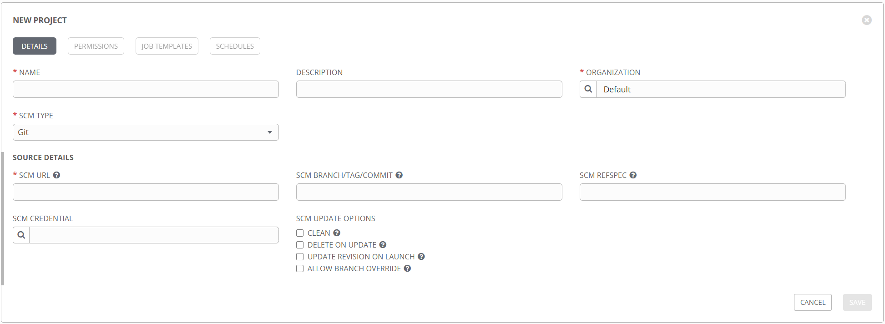

Before creating job templates, credentials, inventories, and all the things necessary to run a playbook, Tower needs to know where to find all the files.
Ansible is just files, after all.
Rather than copying all your project files to the server hosting Tower, it instead relies on a connection to a source control repository.
This allows a myriad of options when it comes to deciding which files, or versions of files, to use when running playbooks.
This is accomplished with the *Project* object in Tower, which provides the configuration for connecting to a source control repository and providing a reference point when creating other Tower objects.

When creating a Tower project, there are two common options for the protocol, HTTPS and SSH.
The below examples will cover both scenarios.
The repository for this example is [here](https://github.com/murrahjm/PSSummit2019), and it has several playbooks in various folders.

## Connecting to GitHub with HTTPS

The project creation process is pretty straightforward, just needing a name, SCM type (git), an address, and a credential.

The SCM URL can be found from the github repository, by clicking the clone option.
This is the same URL you would use if cloning a repo manually, or with VSCode.

### Creating a Personal Access Token

Connecting to github via HTTPS requires the creation and use of a Personal Access Token (PAT), rather than just entering your primary username and password.
Of course, if you're reading a public repository you don't technically need a credential at all, but if you want to get a private repository you will need to authenticate.
This token is created in your github account settings, under the developer options.
The PAT creation option has great granularity in permissions, so you don't need to give more rights than needed.
In the case of a Tower project, we really only need to read repository data.
If you're connecting to a private repository, there doesn't appear to be a way to grant only read rights, so you'll need to grant full repo control.

Be sure to copy the generated token before closing the page!

### Creating the Credential Object

The next step is to create a Tower credential object with the new PAT.
The obvious credential type would appear to be `GitHub Personal Access Token`, but that would be wrong (imagine my surprise).
The correct credential type is `Source Control`.
Any other type will not be available to add to the project, which I guess makes sense.
When creating the `Source Control` credential, use the GitHub username and the PAT as the password.

This is everything that's needed to create a project.
Navigate to the Projects page and create a new project for the github repo.

If everything was created correctly, you should see a successful job in tower of type `SCM Update`.

If the sync job completed successfully (green circle), you can now create a job template from any playbook in that project.

## Connecting to GitHub via SSH

A second option for connecting to GitHub is with SSH.
The credential setup is a bit more complicated, but is otherwise similar to the HTTPS method.
First, the easy part.
Find the URL in GitHub from the same window as the HTTPS URL.
Click on the *Use SSH* link in the upper right corner, and copy the SSH connection string.
This is the value to be entered into the *SCM URL* field when creating the project.

The message on that screen gives us a clue to our next step.
An SSH connection requires a private/public key pair, similar to a web server certificate.
In this interaction, the private key will be held in Tower, and the public key will be added to GitHub.

### Creating the key pair

The command for this is `ssh-keygen`, and, thanks to OpenSSH being added to Windows, should be available on either Windows or Linux.
When run, the command will prompt for a location to save the files, and a passphrase to secure them.
The output should look something like this:

In the directory specified there should be two files, `id_rsa` (the private key), and `id_rsa.pub` (the public key).

That's pretty much it for the creation of the files.
The next step is to post the contents of these files in the correct locations.

### Creating the SSH Tower Credential

Similar to the PAT credential above, begin by creating a Tower credential object, with a type of `Source Control`.
This time though, instead of the *USERNAME* and *PASSWORD* fields, paste the contents of the `id_rsa` file into the *SCM PRIVATE KEY* field, and enter the passphrase into the *PRIVATE KEY PASSPHRASE* field.

The next step is to tell GitHub to trust this ssh key and grant it permissions.

### Granting access via GitHub

Login to github.com, and again go to the *Settings*.
Select the *SSH and GPG keys* section.
Click *New SSH key*.

Create a descriptive title for the key and paste in the contents of the `id_rsa.pub` file created earlier.
When clicking on *Add SSH key* you may be prompted to re-enter your github password.

The key should now be listed on the SSH keys page.

That is the extent of the credential setup.
At this point, any project that references the SSH credential object and SSH URL, should be able to connect to the repository.
A new project might look like this:

## Conclusion

If you are following along at home, at this point you should have two working projects that are successfully retrieving data from a GitHub repository.
While other source control products will have different methods for granting access, the process and configuration from the Tower side should be relatively similar.
On the subject of which method is better, I don't have a concrete answer, unfortunately.
GitHub documentation says that HTTPS with a PAT is recommended, and, personally, I find that method to be a tad easier.
It's really up to you though, depending on your preference and any security requirements you may have.
Have a strong opinion on it? Leave a post in the comments!
