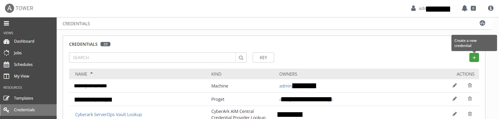

Where Ansible provides `ansible-vault` for encrypting passwords and other secret strings, this method doesn't scale well with multiple playbooks and projects, especially when using Tower with multiple teams of people.
It also doesn't provide the granular access that Tower uses for most other objects.
Enter the *credential* tower object.
The [credential](https://docs.ansible.com/ansible-tower/latest/html/userguide/credentials.html) object type in Tower provdes a more robust method for storing these secrets.
At the most basic level it provides the `machine` credential, which effectively passes the username and password to a machine when running a playbook.
This can be an ssh key if linux, or a username and password if using Windows.
It also provides options for specifying the become parameters for elevation.
There are a few benefits to this method:

1. **scalability** - when using an account in multiple playbooks, the ansible-vault encrypted string must be saved in each project folder for access.
When the time comes to change that password, it must also be updated in each of those saved locations.
By contrast, a credential object in Tower is created once, then can be applied to as many templates as needed, within a given organization.
When the password needs to be changed it only need to be updated in a single location, and no Ansible code needs to be modified.
2. **granular control** - `ansible-vault` encryption is an all-or-nothing event.
The string used to perform the encryption is also used to decrypt and use the password.
If an account needs to be shared for use, the vault encryption string must be given to each party.
This also allows others to decrypt the string and retrieve the plaintext password.
Tower, on the other hand, provides granular access when sharing credentials.
Rights can be granted for `read`, `use`, `update`, and `admin`.
If needed, a credential can be shared with `use` rights, allowing someone to use the credential in a playbook, but not retreive the underlying plain text password.
Additionally, a credential object can be attached to a job template, and the job template itself can be shared.
In this scenario, the credential can only be used in the context of the job template, with no other use cases.
3. **modularity** - `ansible-vault` encrypted strings must live with the application code.
When moving from a development environment to production, replacing the credentials in an an automated fashion is tricky, often resulting in more encrypted secrets.
With Tower, however, the credential details are separated from the application code.
A credential object in the development Tower instance can reference the development user account, while the production instance can have a reference to the production account.
The code only needs a reference to the credential object, which can be modified in a pipeline, or the credentials could have the same name between environments.

> **Note:** Modifying existing Ansible playbooks to use Tower credential objects instead of vaulted secrets may not be a trivial task, depending on the configuration.
If you are migrating playbooks to Tower, you may consider using the `Vault` credential type as a temporary measure to ease migration efforts.
The `Vault` credential type is synonymous with passing the vault password at the command line, and can be used for decrypting any vaulted strings in the playbook or associated files.
While a vaulted string in a playbook still suffers from some of the issues mentioned above, this can reduce the complexity of moving to a Tower environment, and can be slowly replaced over time with other credential objects.

## Creating a Machine Credential

To create a credential object login to the tower instance, navigate to the **CREDENTIALS** section, and click the green `+` sign.



Give your credential object a recognizable name, and select the type from the **CREDENTIAL TYPE** field.
The credential type indicates how the credential will be used.
In the most common case, that of the `Machine` credential, the values are passed in to the playbook as the `ansible_user` and `ansible_password` variables.
This is the most common credential type, and is required when connecting to machines from an inventory file.

For other credential types, it is important to understand how the values are to be used in a playbook.

When you select a credential type, additional fields will appear on the form that are specific to that type.
In the case of the `Machine` credential, the fields support username / password pairs, as well as SSH key data.
In the case of a machine credential for an Active Directory (AD) account, use the following fields:

* **USERNAME** - the fully qualified account name.
Note the domain portion should be upper case for compatibility with linux KERBEROS requirements.
* **PASSWORD** - the password to the account.
Review [this](/Cyberark-Credential-Lookup) article for info on how to integrate with CyberArk.
* **PRIVILEGE ESCALATION METHOD** - for windows this will always be `runas`.
* **PRIVILEGE ESCALATION USERNAME** - in most cases this will be the same value as the **USERNAME** field.
* **PRIVILEGE ESCALATION PASSWORD** - the password for the above specified account.
Also supports CyberArk integration.

## Other Credential Types

While the machine credential is used for connecting to the machines in your inventory, other credential types have more varied use cases.
Regardless of the type, the general purpose of the credential object is to pass secure data into your playbook, either as an `extra_var` or as an environment variable.
When attached to a template, that output can be referenced in a playbook task to connect to whatever system you're dealing with.
How that info is passed is unique to the credential type.
The majority of the built-in credential types are documented [here](https://docs.ansible.com/ansible-tower/latest/html/userguide/credentials.html#credential-types).
You can also browse the Tower API `credential_types` endpoint to get a JSON view of the credential type configuration, though some of that data may be missing or incomplete, so be sure to cross reference with the documentation.
The API option is great if you have created many custom credential types and want to get the details on those.

### Anatomy of a credential type

Looking at the API output begs the question: "What are these things I'm looking at?"
Credential types have two main components, the input definition and the output definition.
As I mentioned above, the purpose of the credential object is to take secure data (the input), and pass it to a playbook (the output).
These components are referred to as `inputs` and `injectors`.

### Inputs

Inputs are exactly what they sound like, a definition of the input fields that should retrieve data from the user.
Recall when you created the machine credential above, there were several fields to fill out and a description of each one.
That is all defined in the input fields.
So an input field like this:

```json
"inputs": {
    "fields": [
        {
            "id": "username",
            "label": "Access Key",
            "type": "string"
        },
        {
            "id": "password",
            "label": "Secret Key",
            "type": "string",
            "secret": true
        },
        {
            "id": "security_token",
            "label": "STS Token",
            "type": "string",
            "secret": true,
            "help_text": "Security Token Service (STS) is a web service that enables you to request temporary, limited-privilege credentials for AWS Identity and Access Management (IAM) users."
        }
    ],
    "required": [
        "username",
        "password"
    ]
}
```

is going to result in a credential form that looks like this:


The `fields` section defines that, with the `required` section defining which fields must be filled in and which are optional.

### Injectors

Injectors, by contrast, are the definition of our output.
There are a few documented options for output, namely file, env, and extra_vars.
More details can be found in the [official documentation](https://docs.ansible.com/ansible-tower/latest/html/userguide/credential_types.html), but an injector configuration like this:

```yaml
file:
  template: |-
    [ovirt]
    ovirt_url={{host}}
    ovirt_username={{username}}
    ovirt_password={{password}}
    ovirt_ca_file={{ca_file}}
env:
  OVIRT_INI_PATH: '{{tower.filename}}'
  OVIRT_URL: '{{host}}'
  OVIRT_USERNAME: '{{username}}'
  OVIRT_PASSWORD: '{{password}}'
```

Would result in an INI file with `ovirt_url`, `ovirt_username`, etc. fields, and 4 environment variables.
Note the use of jinja in the example, this section allows all the jinja you're used to in ansible, so you can get as customized as you want.
As for the variables listed in the substitution blocks, these are the `id` fields defined in your input block.
A much simpler example might be just taking your input fields and passing them as extra_vars.

```yaml
extra_vars:
  username: '{{username}}'
  password: '{{password}}'
```

## Custom Credential Types

If you can't find an existing credential type that works for your use case, create your own!
The components above are all you need to create your own custom credential type.
Once you decide on your inputs and outputs, use the *CREDENTIAL TYPES* section in Tower to define your type.
After that it should be available for use any time you create a new credential object.
Note: this is a server-wide setting, so if you have a multi-organization setup in Tower, custom credential types are global objects, and can't be scoped to a single org.
You will also need full tower admin rights to create them, organization admin rights are insufficient.

The Tower interface is the most straightforward way to manually create a custom credential type, but if you want to do it via the command line, or with an ansible playbook, you can use the [tower_credential_type](https://docs.ansible.com/ansible/latest/modules/tower_credential_type_module.html) module.

Just like the web interface, you must provide inputs, injectors, a name, and optional description.
If you are familiar with other ansible modules that configure tower assets, you'll recognize the options for providing tower connection info.
This example creates a custom credential type that can be used as a generic REST API credential type:

```yaml
- name: create generic REST API Custom Credential Type
  tower_credential_type:
    kind: cloud
    name: REST API
    description: credential for generic REST API, with api key and secret pair or username / password pair
    inputs:
      fields:
      - id: api_key
        type: string
        label: api key or username for rest api authentication
      - id: api_secret
        type: string
        secret: true
        label: api secret or password or other sensitive data for rest api authentication
      - id: url_base
        type: string
        label: the common base URL for api access, i.e. https://server.domain.com/api/v1
    injectors:
      extra_vars:
        api_key: !unsafe "{{ api_key }}"
        api_secret: !unsafe "{{ api_secret }}"
        url_base: !unsafe "{{ url_base }}"
    tower_host: "https://tower-url.domain.com"
    tower_verify_ssl: no
    tower_username: "{{tower_username}}"
    tower_password: "{{tower_password}}"
    state: present
```

A couple of things to note here:

1. for custom credential types the `kind` value will almost always be "cloud".
2. the use of the `!unsafe` keyword is important for passing the jinja syntax unmodified.
When adding the injector configuration in the tower GUI, it reads everything as just text, but passing it in a playbook would cause the jinja to be replaced before being passed to the module.
The `!unsafe` tells ansible not to do any of that, and to just pass it as text.

Whether created with the GUI or the playbook, custom credentials can be used just like any of the built-in credential types to create any credentials you need for your playbooks.
That is pretty much all there is to credentials, or at least a general overview of the options in Tower.
One great new feature that has been added is the ability to integrate with external password vaults, so a credential object can perform a "checkout" or "lookup" of a password when it is accessed, rather than storing the password itself in Tower.
Check out [this article](/Cyberark-Credential-Lookup) for a detailed look at this integration as it relates to CyberArk, one of the more common enterprise password vault solutions.
